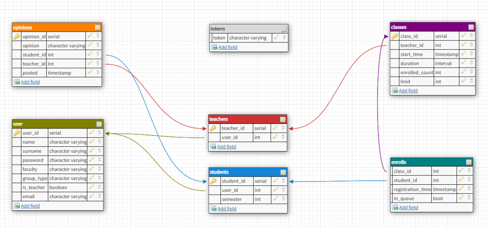

# PE Application Backend

## Application purpose

At the university, many students tend to ommit Physical Education lessons in case of health problems or many other reasons.
Many teachers require them to attend another PE lesson to compensate for their absence.
The purpose of this application is to make it easier for students to find classes which they can attend with no fear of getting kicked out of the class 
because of too many students trying to make up for their absence. This risk is exceptionally high near the end of the semester and need for such system arises.

## Architecture

This Node.JS application is a REST API created with Express framework. It's connected to PostgreSQL database, which is hosted online using Heroku. Application uses
Sequelize library to connect with database and make various queries. 

